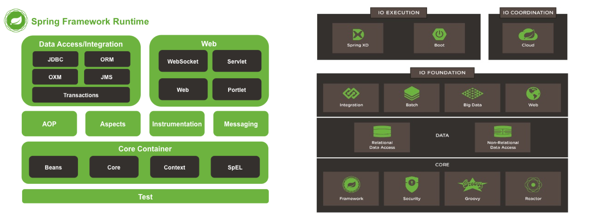

### SpringBoot introduction!!


---
### 自己紹介

- Twitter : @keiyonekawa |
- Androidアプリコンテスト(ITA-A4)で企画賞受賞 |
- 最近は筋トレとkotlinにハマってます |


---
### Spring Frameworkの構造




---
### 問題点

- サブプロジェクトがどんどん肥大化。。 |
- 各プロジェクトを組み合わせて使うには、多くの初期設定が必要・・・ |
- モジュールが多すぎてとっつきにくい、、、 |


---

### そこで現れたのが・・・

---

### Spring Boot!!!

---

### Spring Bootとは？

- 複雑化したSpringプロジェクトが提供する様々なライブラリやフレームワークを、手っ取り早く使えるようにしたフレームワーク

---

### Spring Bootの特徴

- あらかじめオススメのプロジェクトの組み合わせが含まれている 
- 依存ライブラリを同梱するだけで、自動で設定が有効になる 
- 組み込みTomcatを同梱し、アプリを即実行可能 

---

### 開発環境

- Spring Tool Suite(STS) plugin <br>
　　　　→　STSには「Spring Starter Project」という「Spring Boot」プロジェクトの雛形を簡単に作る仕組みが用意されている

- gradle plugin

---

### 依存ライブラリ

```build.gradle

dependencies {
  runtime('org.springframework.boot:spring-boot-devtools') 
  compile('org.springframework.boot:spring-boot-starter-jdbc')
  compile('org.springframework.boot:spring-boot-starter-thymeleaf')
  compile('org.springframework.boot:spring-boot-starter-web')
  compile('org.springframework.boot:spring-boot-starter-data-jpa')
  compile('mysql:mysql-connector-java')
  compile('org.webjars:bootstrap:3.3.7')
  compile('org.webjars:jquery:3.2.1')
  compile('org.webjars:jquery-ui:1.12.1')
}

```

@[2](Spring DevTools : アプリケーションを再起動することなく、ソースコード、htmlの変更が反映)
@[4](thymeleaf : 素のHTMLに「th: ***」属性をつけることで、動的な画面が作れるテンプレートエンジン)

---

### Controller

```EmployeeController.java

@Controller
public class EmployeeController {

    @Autowired
    EmployeeService employeeService;
    
    @RequestMapping("/employee/list")
    public String list(Model model) {
        List<EmployeeEntity> employeeList = employeeServiceImpl.findEmployee();
        model.addAttribute("employeeList", employeeList);
        return "employee-list";
    }
}
```

---

### thymeleaf

繰り返し
th:each="変数 : ${コレクション}"

``` employee-list.html

        <tr th:each="employee : ${employeeList}" th:object="${employee}">
          <td th:text="*{id}"></td>
          <td th:text="*{lastName} + ' ' + *{firstName}"></td>
          <td th:text="*{age}"></td>
          <td th:text="*{sex}"></td>
          <td th:text="*{experience != null} ? *{experience} : '-'"></td>
          <td th:text="*{language != null} ? *{language} : '-'"></td>
          <td th:text="*{licence != null} ? *{licence} : '-'"></td>
        </tr>
        
```

--- 

### 最後に


---

### SpringBootはWebアプリケーションを高速簡単、ハマらずにWebアプリケーションの開発をサポート


